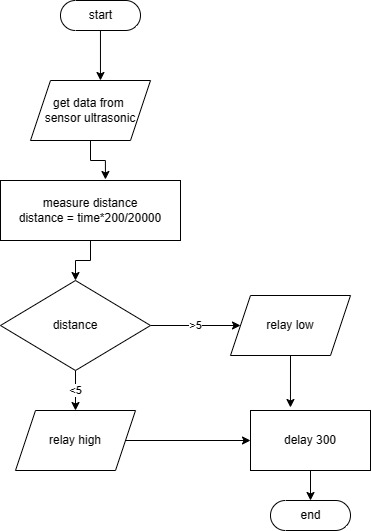

# Automated Dispensers With Ultrasonic Sensor
Dispenser otomatis dengan sensor jarak atau ultrasonik merupakan jenis dispenser yang menggunakan teknologi sensor untuk mengdeteksi keberadaan tangan atau objek di depannya. Alat ini akan secara otomatis mengeluarkan cairan, seperti air minum atau sabun, ketika sensor mendeteksi adanya tangan atau objek di depannya. Dispenser otomatis dengan sensor jarak atau ultrasonik sangat berguna untuk menjaga kebersihan tangan dan menghindari kontak langsung dengan cairan yang dikeluarkan. Selain itu, alat ini juga dapat membantu menghemat cairan dengan mengeluarkannya hanya ketika diperlukan.

# Our Team

 

 
      
    [Teknik Informatika](http://if.uinsgd.ac.id/) [UIN Sunan Gunung Djati Bandung](https://uinsgd.ac.id/) 

## Alat dan Bahan
1. Kardus
2. Lem tembak/lem bakar
3. Alat lem tembak
4. Penggaris
5. Kater
6. Gunting
7. Balpoin/pensil
8. Sensor Ultrasonic
9. Relay 5V
10. Selang Pompa 1 m
11. Mini Pompa 3V (DC)
12. Casing Akrilik Arduino (Opsional)
13. Kabel Jumper Male to Female 20 cm
14. Arduino Uno
15. Kabel Data Tipe C
16. Kabel Data Printer (Tipe B)
17. Adaptop Charger HP

## Flowchart 
Berikut adalah flowchart project ini
 
